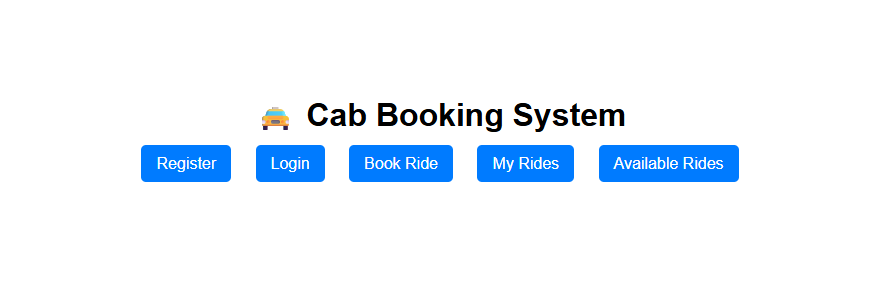
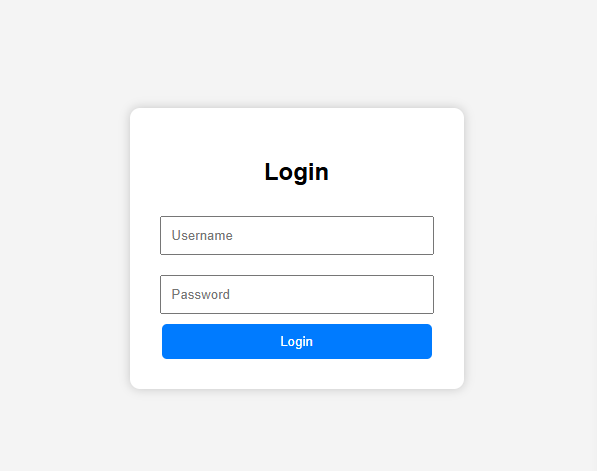
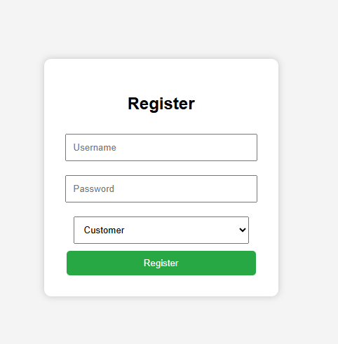
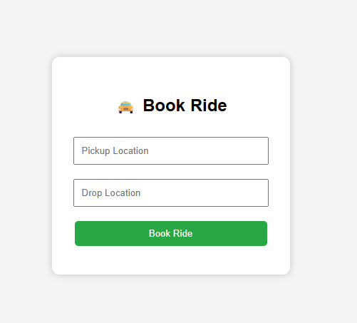
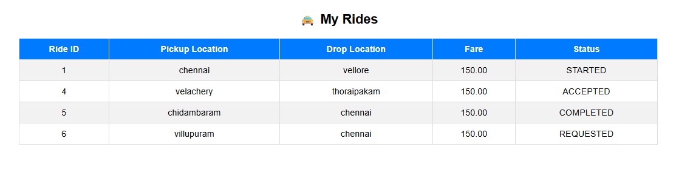
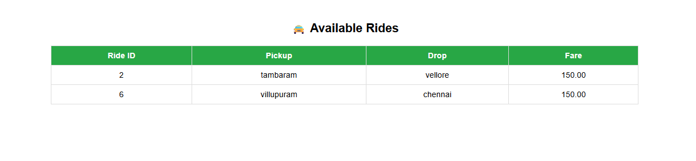

# Cab Booking System

A Django-based web application that allows customers to book rides and drivers to manage ride requests through a role-based system.

## Overview

The Cab Booking System is designed to simplify the process of booking and managing cab rides. The application supports separate roles for customers and drivers, enabling customers to book rides and drivers to view and manage ride requests.

This project was developed using Python, Django, and MySQL to gain hands-on experience in full-stack web development, database management, authentication, and role-based access control.

## Features

* User Registration and Login
* Role-Based Access (Customer and Driver)
* Book Cab Rides
* View Available Rides
* Manage Ride Requests
* Driver Dashboard
* Customer Dashboard
* Database Integration Using MySQL
* Responsive User Interface

## Technologies Used

* Python
* Django
* MySQL
* HTML
* CSS
* Bootstrap
* Git
* GitHub

## Modules

### Customer Module

* Register and Login
* Book a Ride
* View Ride Details
* Track Ride Status

### Driver Module

* Register and Login
* View Available Rides
* Accept Ride Requests
* Manage Assigned Rides

## Database Design

The application uses Django Models and MySQL for storing:

* User Information
* Driver Information
* Ride Details
* Booking Records

## Key Concepts Implemented

* Django Authentication
* Role-Based Authorization
* CRUD Operations
* Django ORM
* Form Handling
* Database Management
* Template Rendering

## Screenshots

### Home Page

### Login page

### Register page

### Ride Booking

### My Rides

### Available Rides

## Learning Outcomes

* Full Stack Web Development
* Django Framework
* MySQL Database Integration
* User Authentication
* Role-Based Access Control
* CRUD Operations
* Git and GitHub

## Future Enhancements

* Online Payment Integration
* Ride Fare Calculation
* Live Location Tracking
* Email Notifications
* Admin Dashboard

## Author

Aruna P

B.Tech Information Technology Graduate

Aspiring Python Full Stack Developer
